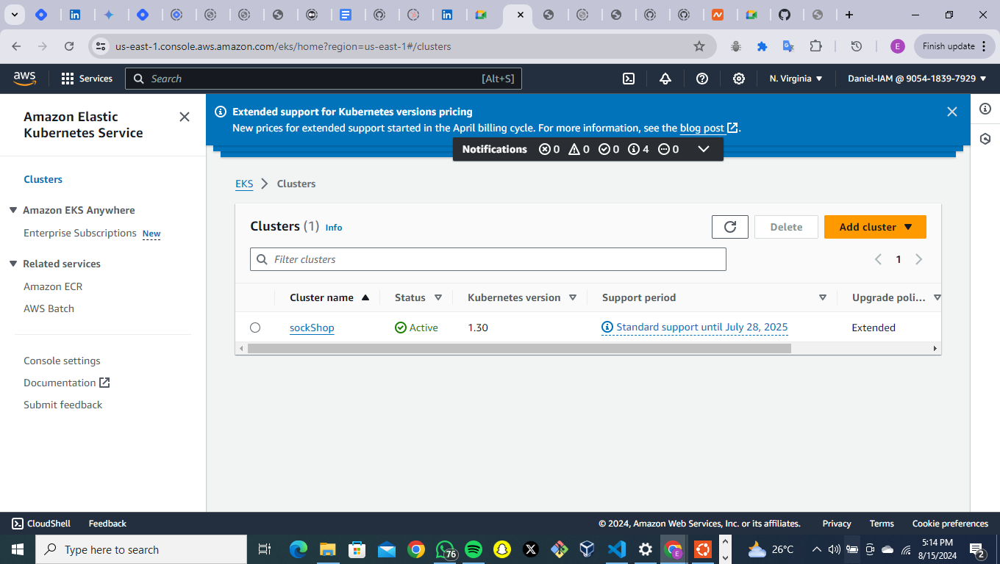
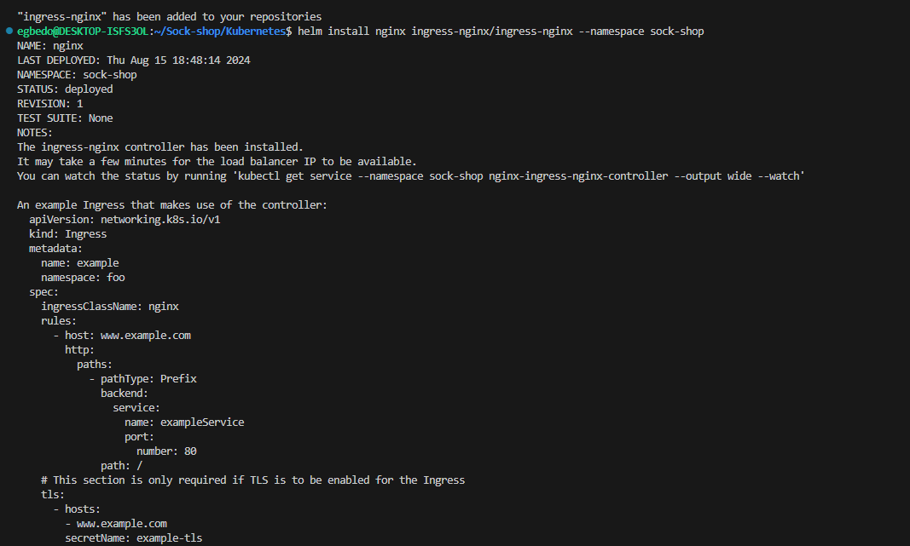
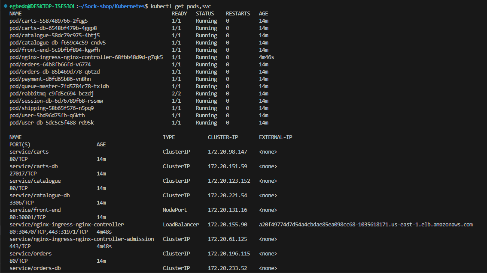
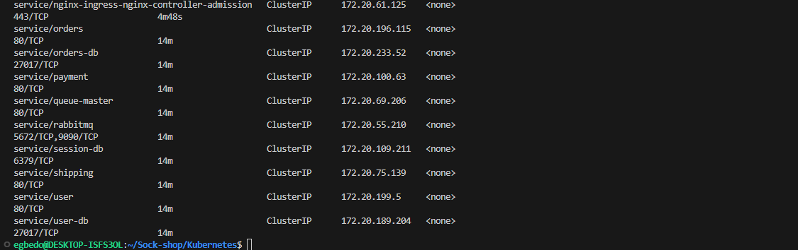
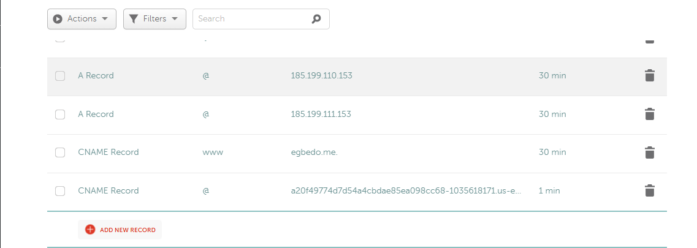
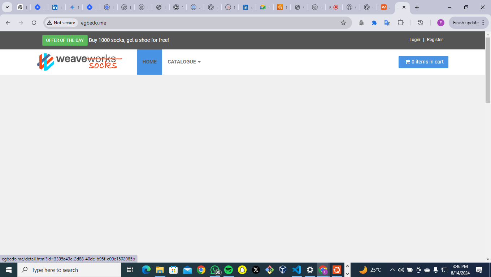
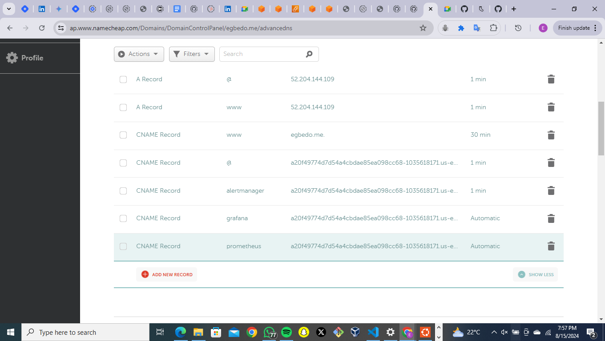
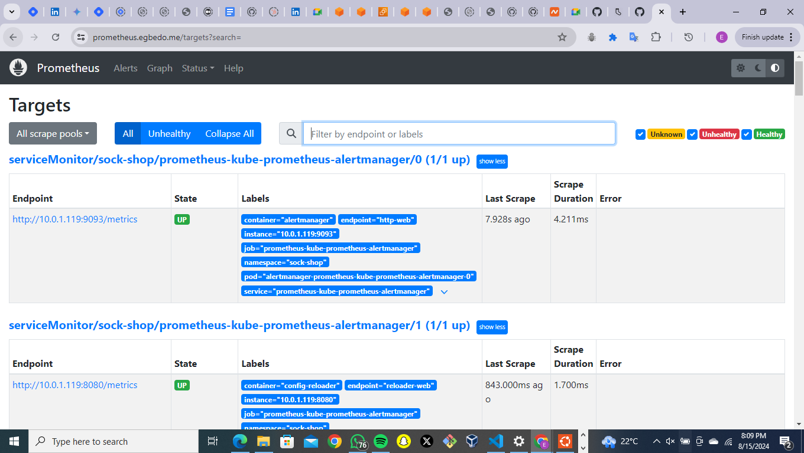

# Deploying the Socks Shop Microservices Application using Infrastructure as Code
## Introduction
In this project, we'll explore how to deploy the Socks Shop microservices application using Infrastructure as Code (IaC) techniques. The Socks Shop is a demonstration of a microservices architecture, and the repository we'll be working with was made available on GitHub. By automating the deployment process, we can ensure the application is set up quickly, consistently, and in a maintainable way.

## Prerequisites
Before we begin,I made sure of have the following:

#### GitHub Account: 
Needed to access the Socks Shop repository on GitHub.
#### IaC Tool: 
Chose Terraform as my Infrastructure as Code tool.
#### Cloud Provider Account: 
Selected AWS as the IaS  where my Kubernetes cluster will be hosted.
#### Kubernetes Cluster: 
We'll need a Kubernetes cluster set up in AWS.
#### Let's Encrypt Account: 
To secure our application with HTTPS, we'll need a Let's Encrypt account.
#### GitHub Actions: 
GitHub Actions will be used to set up a deployment pipeline to build and deploy the Socks Shop application to the Kubernetes cluster.
#### Helm: 
Helm is a package manager for Kubernetes that provides an easy way to find, share, and use software built for Kubernetes.
#### Prometheus: 
Prometheus is an open-source monitoring and alerting toolkit designed for reliability and scalability. It collects metrics from configured targets at given intervals, evaluates rule expressions, displays the results, and can trigger alerts if some condition is observed to be true.

## Deployment Pipeline
The deployment pipeline for the Socks Shop application consists of the following steps:

#### Source Code: 
The application's source code is stored in the GitHub repository that was provided to us
#### Infrastructure Provisioning: 
Using Terraform We'll provision infrastructure, including the Kubernetes cluster and supporting resources.
#### Application Deployment: 
After we have set up the infrastructure in place, we'll deploy the Socks Shop microservices to the Kubernetes cluster.
#### Monitoring and Logging: 
To ensure the application's health and track its operations, we'll set up Prometheus for monitoring and Grafana for logging.
#### HTTPS and Security:
 To secure the application, we'll use Let's Encrypt to obtain SSL/TLS certificates and implement network security measures.

 ## Infrastructure Provisioning:
 Using Terraform, we provisioned the necessary infrastructure resources on AWS, including VPCs, subnets, security groups, and EKS cluster. This will allow for a clear and reproducible infrastructure setup.

 1. Made sure we have AWS cli installed
 2. did `mkdir Sock-shop` to set up my sock-shop folder
 3. `cd Sock-shop` and then `terraform init` to initialize terraform then `terraform apply` to apply the configuration to set up my EKS cluster on AWS, the configuration can be found in my `Sockshop-main.tf` file. 
 4. After running the terraform file, my EKS is created as shown below 
  my EKS already created on AWS

 5. After setting up the Kubernetes Cluster on AWS, I went ahead and created a folder in my Sock-shop app. `mkdir Kubernetes` then `cd Kubernetes` and inside the kubernes folder, clone the `deploy.yml` file from the github repo and also create an ingress file with `touch ingress.yml`. the contents of the `ingress.yml` file is added to this repository  

 6. To begin the deployment we first configure the kubectl to connect to the EKS cluster, the specified region and the cluster name. That brings us to the next command.
`aws eks update-kubeconfig --name sockShop --region us-east-1`

7. Next we deploy our clusters by doing `kubectl apply -f deploy.yml ` we'll be shown each cluster being created as follows

8. Next step is to add a Helm chart repository to our Helm client. Helm is a package manager for Kubernetes that allows you to define, install, and upgrade complex Kubernetes applications. `helm repo add ingress-nginx https://kubernetes.github.io/ingress-nginx`

   `ingress-nginx`: This is the name we are assigning to the repository in our local Helm configuration. we can reference this name later when installing charts from this repository.

`https://kubernetes.github.io/ingress-nginx`: This is the URL of the Helm chart repository that hosts the ingress-nginx charts. The ingress-nginx repository contains Helm charts for deploying NGINX as an Ingress controller in a Kubernetes cluster.

9. Next we install the `ingress-nginx Ingress` controller in a Kubernetes cluster using Helm. We use the code `helm install nginx ingress-nginx/ingress-nginx --namespace sock-shop`

10. The next step is to change the default namespace for the current Kubernetes context. We use `kubectl config set-context --current --namespace=sock-shop`

11. Then we retrieve information about the pods and services in the current Kubernetes namespace. using `kubectl get pods,svc`

12. Next step is setting the CName record of our domain `egbedo.me` to point to the load balancer address. One of the first edits we'll do to our domain

13. With this, we'll be able to access the application on `egbedo.me` 

14. The next step is to add the Jetstack Helm chart repository to your local Helm environment. Why is This Important?
 By adding the Jetstack repository, we gain access to all the Helm charts hosted by Jetstack, including the Cert-Manager chart, which is widely used for managing certificates in Kubernetes. We do this by running `helm repo add jetstack https://charts.jetstack.io --force-update`  
 15. Then we install the Cert-Manager application into our Kubernetes cluster
 
 16. We then `touch cert.yml` to create our certificate file and create our certificate to be able to securely access our application.

17. We run `kubectl apply -f cert.yml` to apply the certificate configuration. After doing this, our application shuld e accessible over https as shown below. 

18. The next step is to add the Prometheus Helm chart repository to our local Helm environment. We use the command  `helm repo add prometheus https://prometheus-community.github.io/helm-charts`

19. Next step is to install the Kube-Prometheus-Stack Helm chart into a Kubernetes cluster using   `helm install prometheus prometheus/kube-prometheus-stack -n sock-shop`

20. After doing this, we'll go back to our DNS management and configure or domain name to serve the several values of the grafana, prometheus and alertmanager as shown below.

21. We then run `kubectl apply -f ingress.yml` to apply the new configurations that we made for the grafana, prometheus and alertmanager such that when we visit `prometheus.egbedo.me`, we get 

## Running the CI/CD pipeline

### 1. Configure GitHub Secrets

1. Navigated to my GitHub repository on GitHub.
2. went to **Settings** > **Secrets and variables** > **Actions**.
3. Added the following secrets:
   - `AWS_ACCESS_KEY_ID`:  AWS Access Key ID.
   - `AWS_SECRET_ACCESS_KEY`:  AWS Secret Access Key.
   - `AWS_REGION`:  AWS region (e.g., `us-east-1`).
   - `ANSIBLE_VAULT_PASSWORD`: The password for my Ansible Vault.
   

### 2. Set Up GitHub Actions

Created the `.github/workflows/ci-cd.yml` file in my repository and then put in set up. Uploaded the files to my repository and that concludes the whole set up

## Conclusion
By automating the deployment process for the Socks Shop microservices application using Infrastructure as Code techniques, we've created a reliable, consistent, and maintainable setup. The deployment pipeline, monitoring and logging, and security measures we've implemented will ensure the application is deployed quickly, its health is monitored, and its operations can be traced and analyzed.

This approach sets the stage for future development and scaling of the Socks Shop application, as the automated deployment process can be easily replicated and updated as needed.